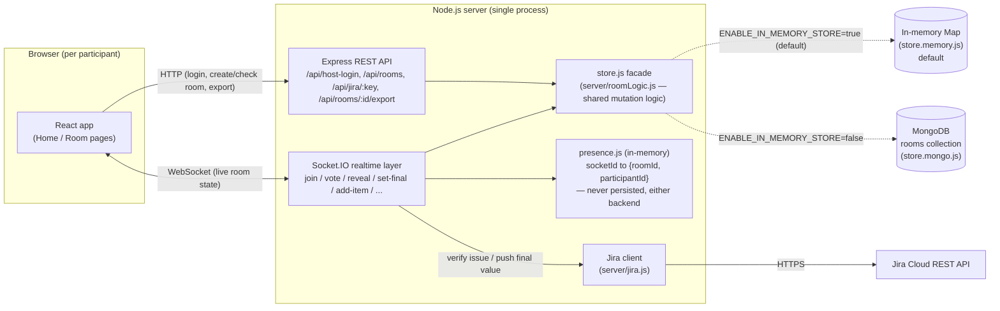
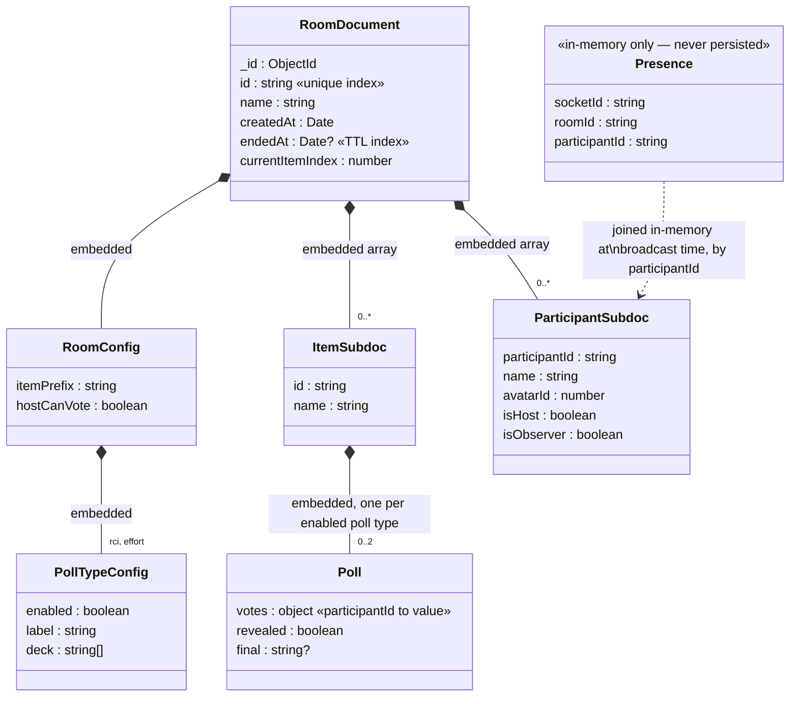
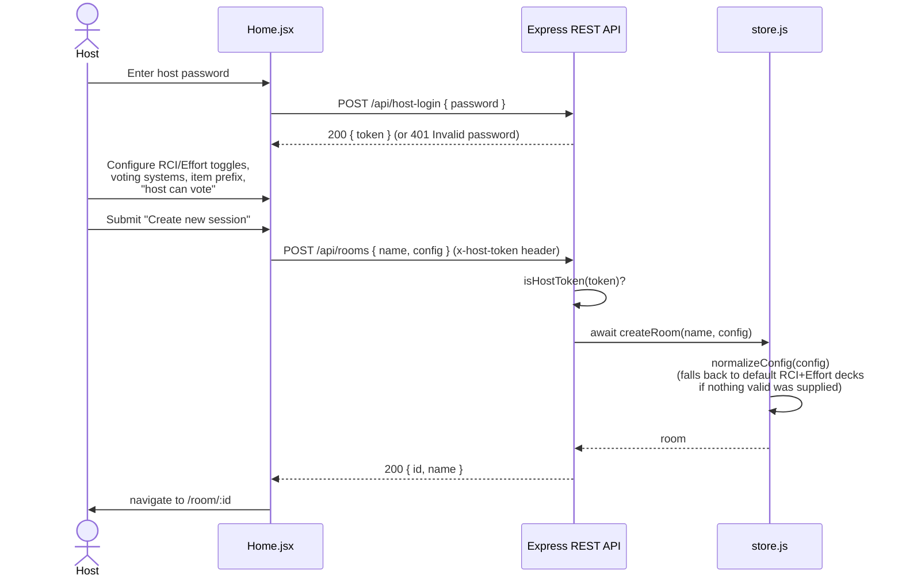
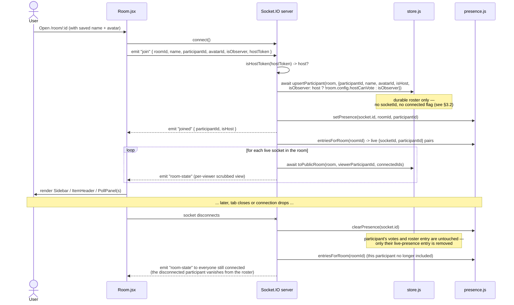
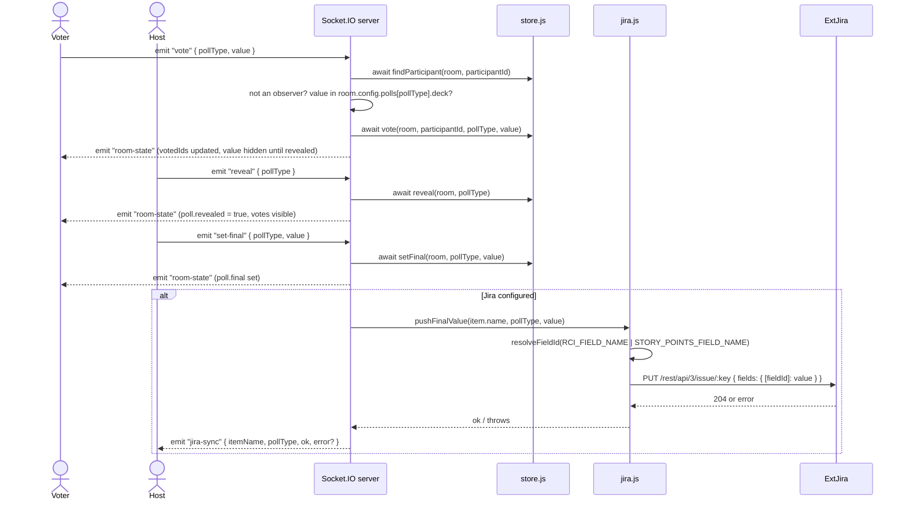
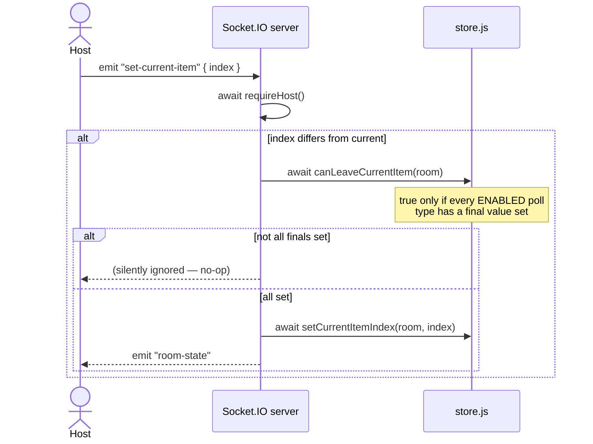
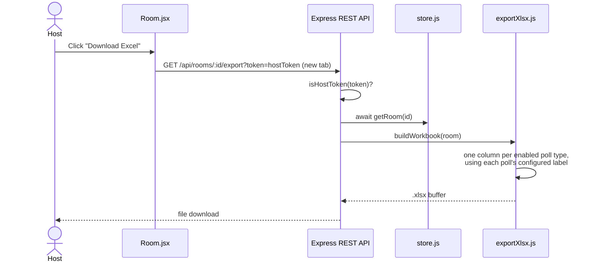
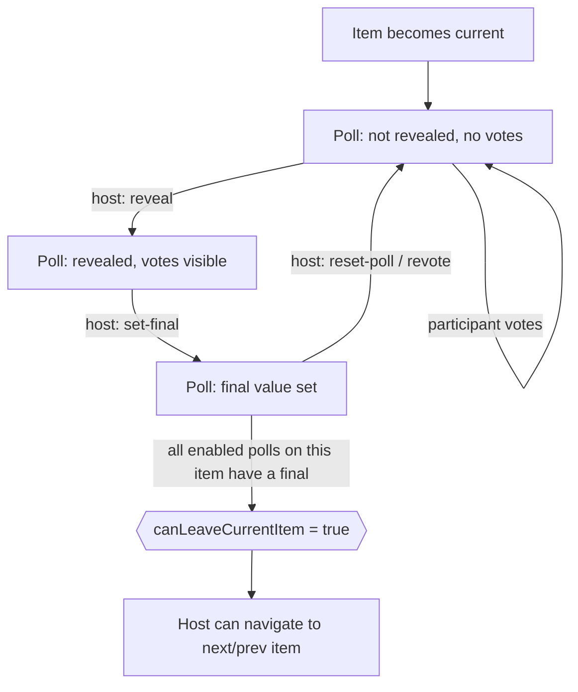
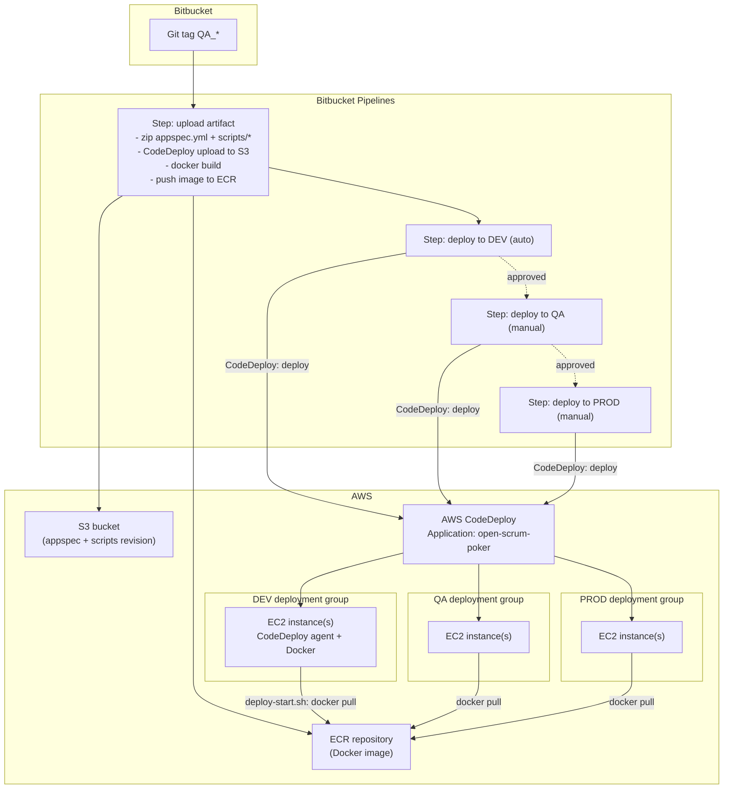
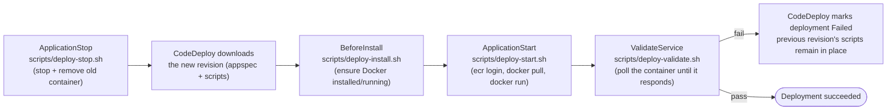

# Open Scrum Poker — Design & Deployment Document

## 1. Overview

Open Scrum Poker is a real-time planning-poker tool for sprint estimation. A host creates a
room, configures one or more voting tables (e.g. Requirement Clarity Index, Effort — both
optional and independently configurable per room), adds sprint items (optionally validated
against Jira and synced back to it), and runs the team through estimation rounds. All
participants see live updates over a WebSocket connection.

**Stack**

| Layer | Technology |
| --- | --- |
| Client | React 19, React Router, Tailwind CSS, Vite, Socket.IO client |
| Server | Node.js (ESM), Express 5, Socket.IO |
| State | Pluggable — in-memory `Map` (default) or MongoDB, chosen at startup via `ENABLE_IN_MEMORY_STORE`; live socket/presence data always stays in-process, never persisted either way (see §3) |
| Integrations | Jira Cloud REST API (issue lookup + writing final values back) |
| Export | `xlsx` — generates a workbook of item/poll final values |

## 2. Architecture



Everything server-side runs as one Node process; Socket.IO rooms (keyed by `roomId`) scope
broadcasts so participants only receive updates for the room they're in. Domain data (room
config, items, polls, the participant roster) is persisted through the `store.js` facade to
whichever backend is active (§3.5); which sockets are *currently* connected is transient,
in-process state that's assembled on top of the persisted roster at broadcast time — see §3.4 —
and is never persisted regardless of backend.

## 3. Data Model (MongoDB)

### 3.1 Design decision: one document per room, everything embedded

A room's config, its items, each item's polls, and its participant roster are all embedded in a
single document in a `rooms` collection — not spread across separate `items`/`participants`
collections referencing a room by id. Reasoning:

- **Access pattern is always "whole room."** Every socket handler ends by re-broadcasting the
  full room state (`emitRoom`); there's no query in this app that needs items or participants
  independent of their room. Embedding matches that access pattern and avoids `$lookup` joins on
  every single vote.
- **Rooms are small and bounded.** A handful of items, a few dozen participants at most — well
  within MongoDB's per-document embedding guidance (documents stay far under the 16MB limit).
- **Atomicity.** A vote, a reveal, or a final-value update is scoped to a single document, which
  MongoDB can update atomically (e.g. `findOneAndUpdate` with a positional operator) — important
  since multiple participants vote concurrently. Splitting into separate collections would trade
  that away for multi-document transactions, with no real benefit here. (The implementation in
  §3.5 currently does a whole-document `replaceOne` rather than a targeted positional update — a
  disclosed simplification, not the ideal described here.)

### 3.2 What does *not* go in MongoDB

`socketId` and a per-participant `connected` flag — how the *original* in-memory prototype keyed
participants — are **not** persisted, in either backend. A WebSocket connection is inherently
tied to *this* server process and *this* moment; storing it in a database implies a durability
guarantee that's meaningless (a restart invalidates every socket id anyway). Instead, both
backends (§3.5) now share this split:

- The persisted **participant roster** (`participantId`, `name`, `avatarId`, `isHost`,
  `isObserver`) lives in the room document/object, keyed by the app's own stable `participantId`
  (already generated client-side and kept in `localStorage` today) — see `roomLogic.js`'s
  `upsertParticipant`/`findParticipant`.
- **Presence** (which `participantId`s currently have a live socket, and which socket) lives
  entirely in `server/presence.js` — a small in-memory `Map`, never written to either the
  in-memory room store or MongoDB.
- The `room-state` broadcast is assembled by reading the room (from whichever backend) and
  joining in presence at send time (see §3.4 and the sequence in §4.2).

### 3.3 Document shape

```jsonc
// rooms collection
{
  "_id": ObjectId("..."),
  "id": "f-R6a8fr",               // short public id (nanoid) used in the URL — unique index
  "name": "Sprint Planning",
  "createdAt": ISODate("2026-09-15T10:00:00Z"),
  "endedAt": null,                // set (not deleted) when the host ends the session
  "config": {
    "itemPrefix": "PRB-",
    "hostCanVote": false,
    "polls": {
      "rci":    { "enabled": true, "label": "Requirement Clarity Index", "deck": ["1","2","3","4","5","?"] },
      "effort": { "enabled": true, "label": "Effort", "deck": ["0","1","2","3","5","8","13","21","34","55","89","?"] }
    }
  },
  "items": [
    {
      "id": "a1b2c3d4",            // nanoid — kept short and stable for the client, not an ObjectId
      "name": "PRB-1234",
      // one key per poll type ENABLED for this room — directly on the item,
      // not nested under a "polls" object (matches the in-memory shape exactly)
      "rci":    { "votes": { "abc123": "3" }, "revealed": false, "final": null },
      "effort": { "votes": {}, "revealed": false, "final": null }
    }
  ],
  "currentItemIndex": 0,
  "participants": [
    { "participantId": "abc123", "name": "Alice", "avatarId": 4, "isHost": false, "isObserver": false }
  ]
}
```

An item only carries a key for poll types that were `enabled` at room-creation time — same rule
as today, just a Mongo subdocument instead of a plain JS object. `<pollType>.votes` is itself a
subdocument keyed by `participantId`; this is safe in MongoDB as long as the key never contains
`.` or starts with `$` — guaranteed here since `participantId` is a nanoid (`[A-Za-z0-9_-]`
alphabet only). Field names throughout (`id` rather than `roomId`/`itemId`) intentionally match
the in-memory backend's shape exactly — both backends' `roomLogic.js` mutation functions operate
on the identical object shape, which is what lets them share code (§3.5).



### 3.4 Indexes, TTL cleanup, and the presence join

- `{ id: 1 }` — **unique**. Every REST/socket lookup goes through this public room id.
- `{ endedAt: 1 }` — **TTL index**, `expireAfterSeconds: MONGODB_ROOM_TTL_SECONDS` (default
  172800 = 48h), with a partial-filter so it only applies where `endedAt` is an actual date.
  Active rooms (`endedAt: null`) never expire; the clock only starts once a host ends the
  session, at which point the room becomes unreadable via `getRoom`/`roomExists` immediately
  (soft delete) and is physically reaped by MongoDB `MONGODB_ROOM_TTL_SECONDS` later.
- **Presence join**: `presence.js` tracks live `{ socketId, roomId, participantId }` triples in
  an in-memory `Map<socketId, ...>`, populated on `join` and removed on `disconnect` — no
  `connected` flag, presence or absence of the map entry *is* the connection state. When
  broadcasting, `server/index.js` calls `presence.entriesForRoom(roomId)` to get every live
  socket for that room, builds a `Set` of their `participantId`s, and passes it into
  `toPublicRoom(room, viewerParticipantId, connectedParticipantIds)` — the one place the durable
  roster (from either backend) and live connections (always in-memory) merge back together, and
  only for the instant it takes to build that one DTO. See §4.2 for the full join/leave sequence.

### 3.5 Implementation status: dual backend behind a toggle

This migration is implemented, gated by an env var rather than a hard cutover:

```
ENABLE_IN_MEMORY_STORE=true   # default — in-memory Map, resets on restart
ENABLE_IN_MEMORY_STORE=false  # MongoDB-backed, per the schema above
```

**Code layout** (`server/`):

- `roomLogic.js` — pure room-mutation functions (vote, reveal, setFinal, addItem, config
  normalization, `toPublicRoom` DTO assembly, ...). No I/O. Both backends call the *same* code
  here, so business rules can't drift between them.
- `presence.js` — the non-persisted socket/connection tracking from §3.2/§3.4, shared by both
  backends (it was never backend-specific to begin with).
- `store.memory.js` — today's `Map<roomId, room>`, now expressed as thin async wrappers around
  `roomLogic.js` (mutating the object in the Map persists it, same as before).
- `store.mongo.js` — MongoDB, using the driver directly. Each mutating call does
  fetch → mutate via `roomLogic.js` → `replaceOne`, rather than the fully targeted
  `findOneAndUpdate`/positional-operator approach floated in the original draft of this
  section. That's a deliberate, disclosed simplification: it reuses proven logic instead of
  hand-written Mongo query fragments that couldn't be exercised against a live database in the
  environment this was built in. It's correct, but not maximally write-efficient under heavy
  concurrent voting — worth revisiting with real load data.
- `store.js` — the facade `server/index.js` actually imports. Reads
  `ENABLE_IN_MEMORY_STORE` once at startup and re-exports the matching backend's functions.
  Logs which one it picked.

**What changed in `server/index.js`** to make this swap possible without touching the client or
the wire protocol at all: every store call is now `await`ed (Express 5 forwards rejected async
handlers to its error middleware automatically, so this didn't need extra try/catch
boilerplate), and the two places that used to mutate `room.participants[socket.id]` directly
(`join`, `disconnect`) now go through `upsertParticipant`/`findParticipant` plus `presence.js` —
direct object mutation would silently no-op against a MongoDB-backed room, since a fetched
document is a detached snapshot, not a live reference.

**Not yet done, deliberately out of scope for this pass**: retry/backoff on a failed initial
Mongo connection (the driver's own default connection timeout applies — tens of seconds before
it rejects, rather than failing fast), and the targeted-update optimization noted above. Both are
safe to defer since `ENABLE_IN_MEMORY_STORE=true` remains the default and is what's actually
running in every environment today.

## 4. Main Flows

### 4.1 Host creates a room



### 4.2 Participant (or host) joins — and later disconnects



If the room doesn't exist, the server emits `join-error` and the client shows an error screen
with a link back home. Every mutating call in this flow is `await`ed, so the same diagram is
accurate regardless of which store backend (§3.5) is active — `toPublicRoom`'s presence-join step
is exactly the mechanism described in §3.4.

### 4.3 Host adds a sprint item (optional Jira validation)

```mermaid
sequenceDiagram
    actor Host
    participant Panel as ItemsPanel.jsx
    participant WS as Socket.IO server
    participant Store as store.js
    participant Jira as jira.js
    participant ExtJira as Jira Cloud

    Host->>Panel: Type number(s) (comma-separated), submit
    Panel->>Panel: Build full name(s) with room.config.itemPrefix,<br/>filter out duplicates already in the sprint
    loop one item at a time (queued client-side)
        Panel->>WS: emit "add-item" { name }
        WS->>WS: await requireHost(); duplicate name check
        alt Jira configured
            WS->>Jira: fetchIssue(name)
            Jira->>ExtJira: GET /rest/api/3/issue/:key
            ExtJira-->>Jira: issue or 404
            Jira-->>WS: issue data or { notFound: true }
        end
        alt not found / API error
            WS-->>Panel: emit "add-item-error" { name, error }
            Panel->>Host: toast + skip to next queued item
        else ok
            WS->>Store: await addItem(room, name)
            WS-->>Panel: emit "room-state" (updated items list)
        end
    end
```

### 4.4 Voting round (vote → reveal → set final → Jira sync)



`resolveFieldId` caches the Jira field-name → id lookup for the process lifetime and refetches
once if a name isn't found (in case a field was renamed on the Jira side).

### 4.5 Moving to the next item



### 4.6 Exporting results to Excel



### 4.7 Ending a session

```mermaid
sequenceDiagram
    actor Host
    participant WS as Socket.IO server
    participant Store as store.js
    participant Others as All other connected clients

    Host->>WS: emit "end-session"
    WS->>WS: await requireHost()
    WS-->>Others: emit "session-ended" (broadcast to room)
    WS->>Store: await deleteRoom(roomId)
    Note over Store: in-memory: hard delete from the Map.<br/>MongoDB: soft delete (sets endedAt) — see §3.5
    Others->>Others: socket.disconnect(); navigate to "/"
```

## 5. Lifecycle / Flow diagrams

### 5.1 Poll (per item, per enabled poll type) lifecycle



### 5.2 Room-creation configuration decision flow

```mermaid
flowchart TD
    Start([Host opens Create-session form]) --> Name[Enter sprint name]
    Name --> RCI{RCI enabled?}
    RCI -- yes --> RCISys[Pick voting system:<br/>preset or custom]
    RCI -- no --> Effort
    RCISys --> Effort{Effort enabled?}
    Effort -- yes --> EffSys[Pick voting system:<br/>preset or custom]
    Effort -- no --> Validate
    EffSys --> Validate{At least one<br/>poll enabled?}
    Validate -- no --> Err1[Block submit:<br/>"Enable at least one voting table"]
    Validate -- yes --> Options[Options: item prefix,<br/>host-can-vote toggle]
    Options --> Submit[POST /api/rooms]
    Submit --> Room([Navigate to room])
    Err1 --> RCI
```

## 6. Deployment Architecture



### 6.1 What each EC2 instance does on deploy (CodeDeploy lifecycle)



Note the revision CodeDeploy ships is **only** `appspec.yml` + `scripts/*` — the application
code itself is the Docker image already sitting in ECR from the same pipeline run. This is why
`ApplicationStop` (which runs against the *previous* successful revision, before the new one is
even downloaded) always has a working `deploy-stop.sh` to call, except on the very first-ever
deployment to an instance, when CodeDeploy skips that hook automatically.

## 7. Detailed Deployment Plan

### 7.1 One-time AWS setup (per account, before first deploy)

1. **ECR** — create a repository (e.g. `open-scrum-poker`). Note its URI for
   `AWS_REGISTRY_URL` / `ECR_IMAGE`.
2. **S3** — create (or reuse) a bucket for CodeDeploy revisions. Note it for `S3_BUCKET`.
3. **IAM — CI/CD user** used by Bitbucket Pipelines, with permissions to:
   - `s3:PutObject` / `s3:GetObject` on the CodeDeploy bucket
   - `ecr:GetAuthorizationToken`, `ecr:BatchCheckLayerAvailability`, `ecr:PutImage`,
     `ecr:InitiateLayerUpload`, `ecr:UploadLayerPart`, `ecr:CompleteLayerUpload`
   - `codedeploy:CreateDeployment`, `codedeploy:GetDeployment`,
     `codedeploy:GetDeploymentConfig`, `codedeploy:GetApplicationRevision`,
     `codedeploy:RegisterApplicationRevision`
4. **IAM — EC2 instance role**, attached to every instance in every deployment group, with:
   - AWS-managed `AmazonEC2RoleforAWSCodeDeploy` (lets the CodeDeploy agent operate)
   - `ecr:GetAuthorizationToken`, `ecr:BatchGetImage`, `ecr:GetDownloadUrlForLayer` (so
     `deploy-start.sh` can `docker pull`)
5. **EC2 instances** (one Auto Scaling group or a small fixed set per environment — DEV, QA,
   PROD): Amazon Linux 2/2023, with the **CodeDeploy agent** installed and running, and the
   instance role from step 4 attached. Docker itself does **not** need to be preinstalled —
   `deploy-install.sh` installs it on first deploy — but the AMI must have `yum`/`dnf`
   available.
6. **Per-instance config files** (create once, e.g. via EC2 user-data or SSM Run Command, before
   the first deployment to that instance):
   - `/opt/open-scrum-poker/config.env`:
     ```
     AWS_DEFAULT_REGION=<region>
     ECR_IMAGE=<account>.dkr.ecr.<region>.amazonaws.com/open-scrum-poker:latest
     ```
   - `/opt/open-scrum-poker/app.env` (runtime secrets — same keys as the app's `.env.example`):
     ```
     PORT=3001
     HOST_PASSWORD=<per-environment password>
     JIRA_BASE_URL=https://<org>.atlassian.net
     JIRA_EMAIL=<service account email>
     JIRA_API_TOKEN=<token>
     RCI_FIELD_NAME=Requirement Clarity Index
     STORY_POINTS_FIELD_NAME=Story Points
     # State backend — see §3.5. Omit the Mongo lines entirely to stay in-memory.
     ENABLE_IN_MEMORY_STORE=true
     # ENABLE_IN_MEMORY_STORE=false
     # MONGODB_URI=<connection string for this environment's MongoDB>
     # MONGODB_DB_NAME=open_scrum_poker
     ```
7. **AWS CodeDeploy**:
   - Create **Application** `open-scrum-poker`, compute platform **EC2/On-premises**.
   - Create three **Deployment Groups**: `dev`, `qa`, `prod` — each targeting its
     environment's instances (by tag or Auto Scaling group), in-place deployment type, with the
     service role that has `AWSCodeDeployRole` attached.
   - Note each deployment group's name for `DEV_DEPLOYMENT_GROUP_NAME`,
     `QA_DEPLOYMENT_GROUP_NAME`, `PROD_DEPLOYMENT_GROUP_NAME`.
8. **CodeDeploy Application name** → `APPLICATION_NAME`.

### 7.2 Bitbucket repository variables

Set these under **Repository settings → Repository variables** (mark credentials as *Secured*):

| Variable | Example | Notes |
| --- | --- | --- |
| `AWS_DEFAULT_REGION` | `us-east-1` | |
| `AWS_ACCESS_KEY_ID` | — | CI/CD IAM user from 7.1 step 3 |
| `AWS_SECRET_ACCESS_KEY` | — | secured |
| `S3_BUCKET` | `open-scrum-poker-deploy` | |
| `APPLICATION_NAME` | `open-scrum-poker` | CodeDeploy application name |
| `DEV_DEPLOYMENT_GROUP_NAME` | `dev` | |
| `QA_DEPLOYMENT_GROUP_NAME` | `qa` | |
| `PROD_DEPLOYMENT_GROUP_NAME` | `prod` | |
| `DOCKER_IMAGE_NAME` | `open-scrum-poker` | local tag before pushing |
| `AWS_REGISTRY_URL` | `<account>.dkr.ecr.<region>.amazonaws.com/open-scrum-poker` | ECR repo URI |

### 7.3 Release process

1. Merge changes to the main branch as usual (the pipeline is **tag-triggered**, not
   branch-triggered — pushing to `main` alone does nothing).
2. When ready to ship, tag the commit: `git tag QA_2026.09.15 && git push origin QA_2026.09.15`
   (any tag matching `QA_*` triggers the pipeline — naming is otherwise free-form).
3. Pipeline runs **upload artifact** automatically: builds & pushes the Docker image to ECR,
   zips and uploads `appspec.yml` + `scripts/*` to S3.
4. **deploy to DEV** runs automatically right after. Verify the app in DEV.
5. **deploy to QA** — trigger manually from the Bitbucket Pipelines UI once DEV looks good.
6. **deploy to PROD** — trigger manually once QA is signed off.

Each deploy step re-runs the *same* uploaded revision (`ZIP_FILE`/`VERSION_LABEL`) against a
different deployment group, so DEV/QA/PROD always receive identical code for that tag — only
the target instances differ.

### 7.4 Rollback

- **Fast path**: re-trigger a **deploy** step (DEV/QA/PROD) for a previous tag's already-uploaded
  revision from the CodeDeploy console ("Deploy an existing revision"), or re-run an older
  pipeline's deploy step from Bitbucket.
- **Manual path on an instance**: `docker ps -a` to find the previous image tag still cached
  locally (if not pruned), `docker run` it back up, or `docker pull <ECR_IMAGE>@<previous digest>`
  and restart via `deploy-start.sh`'s same steps.
- CodeDeploy itself also supports automatic rollback on deployment failure (configurable on the
  deployment group) — recommended to enable "roll back when a deployment fails" for QA/PROD.

### 7.5 Operational notes

- **State backend is a per-environment choice** (§3.5): `ENABLE_IN_MEMORY_STORE=true` (the
  default) means restarting the container — including the `docker run` that happens on every
  deploy — clears all active rooms; `false` persists to MongoDB instead. Until an environment's
  `app.env` explicitly sets `ENABLE_IN_MEMORY_STORE=false` plus a reachable `MONGODB_URI`, treat
  every deploy to it as disruptive to any live session and communicate planned deploys
  accordingly. A reachable MongoDB instance (Atlas or self-hosted) per environment that wants the
  Mongo backend is not yet part of the AWS setup in §7.1 — provision one before flipping the
  toggle there.
- **Health check**: `deploy-validate.sh` only confirms the HTTP server is listening; there's no
  dedicated `/health` route today. Consider adding one if you want more meaningful validation.
- **Secrets never enter the Docker image** — they're injected at container-start time via
  `--env-file /opt/open-scrum-poker/app.env`, kept out of ECR entirely.
